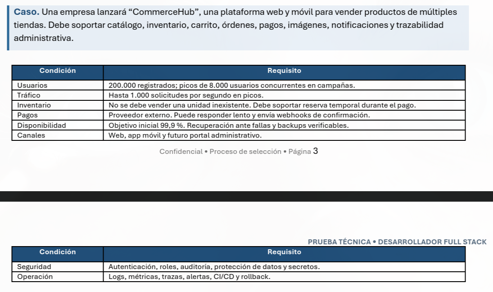
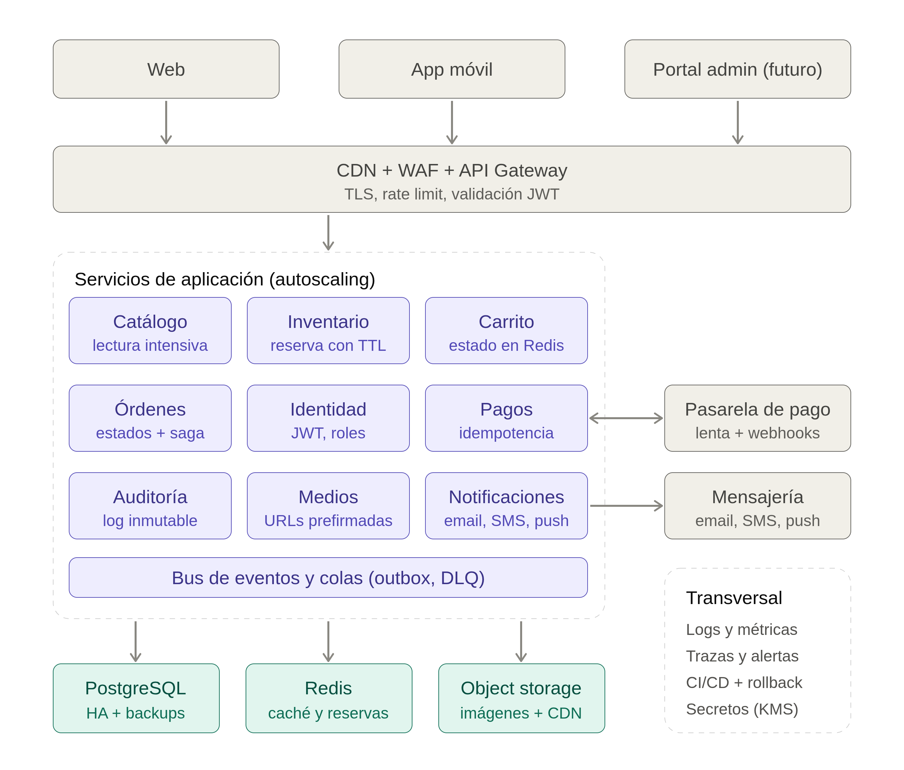

```javascript
app.get('/api/orders', async (req, res) => {
  try {
    const userId = req.query.userId;

    // Using parameterized queries to prevent SQL injection
    const orders = await db.query(
      'SELECT * FROM orders WHERE user_id = $1',
      [userId]
    );

    // For each order, get the related order_items and attach to the order
    for (const order of orders.rows) {
      const items = await db.query(
        'SELECT * FROM order_items WHERE order_id = $1',
        [order.id]
      );
      order.items = items.rows;
    }

    res.status(200).json(orders.rows);
  } catch (error) {
    res.status(500).json({ error: 'Server Error' });
  }
});
```

## 1. Problemas y riesgos identificados - 2.

1. **[Seguridad] Extracción insegura del identificador de usuario:**
   El `userId` debería obtenerse de manera segura a partir del token de autenticación o sesión, y no desde parámetros manipulables directamente por el usuario (query string).

2. **[Mantenibilidad] Mala separación de responsabilidades:**  
   El controlador (`controller`) debería delegar la lógica de negocio a un servicio (`service`), y este, a su vez, consultar los datos a través de un repositorio. Actualmente, toda la lógica y acceso a la base de datos está directamente en la capa del controlador.

3. **[Rendimiento] Problema de N+1 queries:**  
   La implementación actual realiza una consulta principal a las órdenes y luego una consulta adicional por cada orden para obtener sus items, lo que genera un patrón de N+1 consultas y puede afectar seriamente el rendimiento. Lo ideal sería hacer un `JOIN` en la consulta principal para recuperar toda la información necesaria de una sola vez.

4. **[Diseno API / Seguridad] Falta de DTOs (Data Transfer Objects):**  
   No se utilizan DTOs ni para validación de entrada ni para la respuesta. Exponer directamente los modelos de la base de datos supone un riesgo de seguridad y dificulta la evolución de la API.

5. **[Rendimiento / Diseno API] Alto consumo de memoria en casos con muchos registros:**  
   Si un usuario tiene miles de órdenes, se cargarán todas en memoria junto con sus items, lo cual podría saturar la RAM del servidor Node.js y afectar la disponibilidad del servicio.

6. **[Mantenibilidad] Falta de un sistema de logging adecuado:**  
   El manejo de errores simplemente responde al cliente, pero no registra detalles del error en ningún sistema de logs (Pino, Winston, o al menos `console.error`). Esto dificulta el monitoreo y diagnóstico en producción.

7. **[Rendimiento] Ejecución secuencial ineficiente de consultas:**  
   Usar un bucle `for...of` con `await` dentro provoca que las consultas a la base de datos se ejecuten de manera secuencial en lugar de hacerlo en paralelo, incrementando innecesariamente el tiempo de respuesta.

8. **[Matenibilidad / Rendimiento] Ausencia de mecanismos de timeout en consultas:**  
   No existe ningún control de timeout a nivel de código sobre las consultas a la base de datos. Esto puede causar que una consulta trabada o muy lenta ocupe indefinidamente recursos del servidor.
---

## 3. Versión Mejorada del Endpoint

### 3.1. Definición de Entidades (Modelos)

Primero, definimos cómo se mapean las tablas de la base de datos a clases de TypeScript usando decoradores de TypeORM (muy similar a Hibernate/Spring Data JPA o NestJS):

```typescript
import {
  Entity,
  PrimaryGeneratedColumn,
  Column,
  CreateDateColumn,
  ManyToOne,
  OneToMany
} from "typeorm";

@Entity('order_items')
export class OrderItem {
  @PrimaryGeneratedColumn()
  id: number;

  @Column()
  productName: string;

  @Column('int')
  quantity: number;

  @Column('decimal')
  price: number;

  // Relación: Muchos ítems pertenecen a una orden
  @ManyToOne(() => Order, order => order.items)
  order: Order;
}

@Entity('orders')
export class Order {
  @PrimaryGeneratedColumn()
  id: number;

  @Column()
  status: string;

  @CreateDateColumn()
  createdAt: Date;

  @Column()
  userId: number;

  // Relación: Una orden tiene muchos ítems
  @OneToMany(() => OrderItem, item => item.order)
  items: OrderItem[];
}
```

---

### 3.2. Servicio (Capa de Datos)

El servicio ya no necesita escribir SQL crudo. Utilizamos el `Repository` de TypeORM con el método `findAndCount`, ideal para endpoints paginados:

```typescript
import { AppDataSource } from "./data-source";
import { Order } from "./entities/Order";

export class OrderService {
  static async getPaginatedOrdersByUser(userId: number, limit: number, offset: number) {
    const orderRepository = AppDataSource.getRepository(Order);

    // findAndCount ejecuta dos consultas optimizadas bajo el capó:
    // 1. Obtiene los registros con LIMIT y OFFSET + los JOINs necesarios.
    // 2. Cuenta el total de registros que coinciden con el 'where' (para la paginación).
    const [orders, total] = await orderRepository.findAndCount({
      where: { userId: userId },
      relations: ['items'], // Resuelve el problema N+1 haciendo un LEFT JOIN automáticamente
      take: limit,          // Equivale a LIMIT
      skip: offset,         // Equivale a OFFSET
      order: { createdAt: 'DESC' }
    });

    return { orders, total };
  }
}
```
---
### 3.3. DTO (Data Transfer Object)

```typescript
class OrderDTO {
  static fromDatabase(order) {
    // Filtramos propiedades sensibles o internas de la DB
    return {
      orderId: order.id,
      status: order.status,
      date: order.created_at,
      totalItems: order.items.length,
      items: order.items.map(item => ({
        id: item.id,
        name: item.product_name,
        quantity: item.quantity,
        price: Number(item.price)
      }))
    };
  }
}
```
---
### 3.4. Controlador

```typescript
// router.get('/api/orders', authenticateToken, OrderController.getUserOrders);

export class OrderController {
  static async getUserOrders(req: Request, res: Response, next: NextFunction) {
    try {
      const userId = req.user.id; // Asumiendo middleware de auth

      const page = parseInt(req.query.page as string, 10) || 1;
      const limit = parseInt(req.query.limit as string, 10) || 10;
      const offset = (page - 1) * limit;

      const { orders, total } = await OrderService.getPaginatedOrdersByUser(userId, limit, offset);
      const responseData = orders.map(OrderDTO.fromDatabase);

      res.status(200).json({
        data: responseData,
        meta: {
          page,
          limit,
          totalItems: total,
          totalPages: Math.ceil(total / limit)
        }
      });

    } catch (error) {
      logger.error(`Error fetching orders for user ${req.user?.id}:`, error);
      next(error);
    }
  }
}
```
---
## 4. Índices y Ajustes Sugeridos para Base de Datos

### 4.1. Índice Compuesto (Filtro + Ordenamiento)

```sql
CREATE INDEX idx_orders_user_created ON orders (user_id, created_at DESC);
```
> Si solo se tiene un índice en `user_id`, la base de datos encontrará rápido las órdenes, pero tendrá que cargarlas en memoria para luego ordenarlas. Al incluir `created_at DESC` en el mismo índice, los datos ya están pre-ordenados y la base lee secuencialmente las órdenes del usuario, resolviendo el `ORDER BY` con un costo computacional casi nulo.
---
### 4.2. Índice en la Clave Foránea

```sql
CREATE INDEX idx_order_items_order_id ON order_items (order_id);
```
> Las bases de datos relacionales (como PostgreSQL o MySQL) **no crean índices automáticamente** para las llaves foráneas. Sin este índice, por cada orden paginada el motor hará un escaneo secuencial (*Full Table Scan*) sobre toda la tabla de ítems, lo cual destruye el rendimiento a medida que la tabla crece.

## 1.2. Frontend / React
```javascript
function ProductList({ api }) {
  const [products, setProducts] = useState([]);
  const [search, setSearch] = useState('');

  useEffect(() => {
    api.get('/products?search=' + search).then((response) => {
      products.push(...response.data);
      setProducts(products);
    });
  }, [search, products]);

  return (
    <div>
      <input value={search} onChange={(e) => setSearch(e.target.value)} />
      {products.map((p, index) => (
        <Product key={index} data={p} onClick={() => console.log(p)} />
      ))}
    </div>
  );
}
```
## 5. Explique al menos 6 problemas

## 5.1. Mutación directa del estado y ciclo infinito

**Problema:**  
Al ejecutar `products.push(...response.data)` se modifica directamente el array de estado, lo cual viola el principio de inmutabilidad de React. Además, al incluir `products` en el arreglo de dependencias del `useEffect` (`[search, products]`), cada vez que cambia el estado se vuelve a ejecutar el efecto, provocando un ciclo infinito de peticiones.

---

## 5.2. Saturación del servidor por falta de *debounce*

**Problema:**  
Se realiza una petición HTTP por cada tecla presionada en el input, generando múltiples consultas innecesarias y saturando el backend.  
**Mejora:**  
Implementar un mecanismo de *debounce* para que la API solo se consulte cuando el usuario termine de escribir (pausa breve entre teclas).

---

## 5.3. Vulnerabilidad en la concatenación de la URL

**Problema:**  
Concatenar directamente el valor del input en la URL (`'/products?search=' + search`) expone a la aplicación a posibles problemas de inyección de parámetros (Query String Injection), especialmente si el usuario introduce caracteres especiales como `&` o `=`.  
**Mejora:**  
Se recomienda usar `URLSearchParams` para construir la query string de forma segura y robusta.

---

## 5.4. Uso del índice como key en React

**Problema:**  
Utilizar `key={index}` al renderizar listas dinámicas puede causar errores de visualización y problemas de rendimiento si los elementos cambian de orden, se filtran o se eliminan.  
**Mejora:**  
Usar una clave única y estable del propio elemento, como `product.id`.

---

## 5.5. Condiciones de carrera (*Race Conditions*) en peticiones de red

**Problema:**  
Si el usuario escribe rápido, varias peticiones pueden estar en vuelo al mismo tiempo. Debido a la latencia, una consulta antigua puede responder después de una más reciente y sobreescribir los resultados actuales, mostrando datos incorrectos.  
**Mejora:**  
Se debe implementar la cancelación de peticiones anteriores (por ejemplo, usando `AbortController` en `fetch` o la cancelación de peticiones en Axios).

---

## 5.6. Falta de manejo de errores y estados de carga; baja separación de responsabilidades

**Problema:**  
El componente no maneja errores de la petición (`.catch()`), ni gestiona estados de carga (`isLoading`), por lo que ante un fallo o lentitud el usuario no recibe retroalimentación.  
Además, combinar la lógica de datos y la de UI hace más difícil escalar y testear el componente.  
**Mejora:**  
Implementar estados de error y carga, y separar la lógica de red (peticiones) en hooks personalizados o componentes contenedores (*smart/dumb components*).

## 6. Explique cómo evitaría solicitudes excesivas mientras el usuario escribe. 

En lugar de disparar una petición a la API por cada pulsación de tecla, el patrón Debounce "pausa" la ejecución de la función hasta que el usuario deja de escribir durante un periodo de tiempo determinado (usualmente entre 300 y 500 milisegundos).

```typescript
import { useState, useEffect } from 'react';

function SearchInput() {
  const [search, setSearch] = useState('');

  useEffect(() => {
    // 1. Iniciamos el temporizador cada vez que 'search' cambia
    const timerId = setTimeout(() => {
      if (search) {
        console.log('Llamando a la API con:', search);
        // api.get(`/products?search=${search}`)
      }
    }, 400); // 400ms de espera

    // 2. Función de limpieza: si el usuario escribe de nuevo antes 
    // de los 400ms, React ejecuta esto y cancela el temporizador anterior.
    return () => {
      clearTimeout(timerId);
    };
  }, [search]); // El efecto se dispara con cada tecla

  return (
    <input 
      type="text" 
      value={search} 
      onChange={(e) => setSearch(e.target.value)} 
      placeholder="Buscar..."
    />
  );
}
```
## 7-8. Explique cómo manejaría respuestas que llegan fuera de orden, loading, error y cancelación. | Proponga el codigo.

```typescript
import { useState, useEffect } from 'react';
import { useQuery } from '@tanstack/react-query';
import axios from 'axios'; 

// 1. Hook reutilizable para el Debounce
function useDebounce(value, delay) {
  const [debouncedValue, setDebouncedValue] = useState(value);
  useEffect(() => {
    const handler = setTimeout(() => setDebouncedValue(value), delay);
    return () => clearTimeout(handler);
  }, [value, delay]);
  return debouncedValue;
}

function ProductList() {
  const [search, setSearch] = useState('');
  
  // Solo el valor "debounced" disparará la petición
  const debouncedSearch = useDebounce(search, 400);

  // 2. TanStack Query asume el control del ciclo de vida de la petición
  const { data: products, isPending, isError, error } = useQuery({
    queryKey: ['products', debouncedSearch],
    queryFn: async ({ signal }) => {
      // El signal permite cancelar la petición HTTP en progreso
      const response = await axios.get('/products', {
        params: { search: debouncedSearch },
        signal, 
      });
      return response.data;
    },
    // No hacer la petición si el buscador está vacío
    enabled: debouncedSearch.length > 0, 
    // Mantiene los datos anteriores en pantalla mientras carga la nueva búsqueda
    placeholderData: (previousData) => previousData, 
  });

  return (
    <div>
      <input 
        value={search} 
        onChange={(e) => setSearch(e.target.value)} 
        placeholder="Buscar..."
      />

      {isPending && search.length > 0 && <p>Cargando resultados...</p>}
      {isError && <p style={{ color: 'red' }}>Error: {error.message}</p>}

      {!isPending && !isError && products && (
        <ul>
          {products.map((p) => (
            <Product key={p.id} data={p} onClick={() => console.log(p)} />
          ))}
        </ul>
      )}
    </div>
  );
}
```
## Cómo maneja cada problema específico

### 1. Loading y Error (Estados predecibles)
- **TanStack Query** gestiona internamente una máquina de estados.
- Extraes directamente del hook los siguientes estados:
  - `isPending`: cuando no hay datos en caché y la petición está en vuelo.
  - `isError` y el objeto `error`.
- Ya **no necesitas bloques `try/catch` ni variables como `setIsLoading`** esparcidos por el componente.

---

### 2. Respuestas fuera de orden (_Race Conditions_)
- Se soluciona utilizando el arreglo `queryKey`.
- Cada vez que `debouncedSearch` cambia, TanStack Query genera una nueva llave (por ejemplo: `['products', 'zap']`).
- Si la respuesta de una llave anterior (e.g. `['products', 'za']`) llega tarde, la librería **descarta silenciosamente la respuesta vieja**, evitando conflictos en el renderizado.

---

### 3. Cancelación (AbortController nativo)
- La función `queryFn` recibe automáticamente un objeto con la propiedad `signal` (un `AbortSignal` estándar del navegador).
- Al pasarlo a Axios o `fetch`, **TanStack Query cancela la petición HTTP a nivel de red** si cambia la `queryKey` o si el componente se desmonta antes de que el servidor responda.
- Esto ahorra ancho de banda y procesamiento.

---

## Ventajas adicionales sobre el enfoque tradicional

- **Caché en memoria (_Zero-latency UI_)**:  
  Si el usuario busca "Zapatos", borra y vuelve a escribir "Zapatos", TanStack Query sirve los datos desde caché inmediatamente, sin esperar al servidor, mientras realiza un refetch en segundo plano (_stale-while-revalidate_).

- **Deduplicación de peticiones**:  
  Si varios componentes hacen un `useQuery` con la misma `queryKey` al mismo tiempo, TanStack Query ejecuta **una sola petición** y distribuye la respuesta a todos los componentes.

- **Reintentos automáticos**:  
  Ante un error de red o error 500 intermitente, la librería **reintenta la petición automáticamente** (por defecto, 3 veces con retroceso exponencial) antes de declarar un estado `isError`, lo que mejora la resiliencia en conexiones inestables.

- **Mejora de la experiencia de usuario (_UX_)**:  
  La propiedad `placeholderData: (prev) => prev` permite que la lista anterior de productos **no desaparezca abruptamente** (dejando la pantalla en blanco) mientras se carga la siguiente búsqueda, logrando una transición visual mucho más profesional.

## 1.3. SQL / Datos
```sql
SELECT 
  c.name,
  COUNT(o.id) AS orders,
  SUM(oi.quantity * oi.unit_price) AS revenue
FROM 
  customers c
  JOIN orders o ON o.customer_id = c.id
  JOIN order_items oi ON oi.order_id = o.id
WHERE 
  DATE(o.created_at) = '2026-10-01'
GROUP BY 
  c.name
ORDER BY 
  revenue DESC;
```
## 9. ¿Qué problemas de exactitud o rendimiento podrían aparecer?

### Problemas de Exactitud
- **Conteo duplicado de órdenes:**  
  Al hacer `JOIN` con la tabla `order_items`, una orden con 5 artículos diferentes generará 5 filas en el resultado intermedio.  
  Por lo tanto, `COUNT(o.id)` devolverá el número total de artículos comprados, **no** el número de órdenes.

  **Solución:**  
  Usar `COUNT(DISTINCT o.id)` para contar cada orden única una sola vez.

- **Agrupación por nombre (Homónimos):**  
  Agrupar por `c.name` combinará los datos de clientes diferentes que tengan exactamente el mismo nombre (ej. "Juan Pérez").  
  Esto mezclará la facturación y el conteo de órdenes de cuentas distintas.

  **Solución:**  
  Agrupar por el identificador único del cliente:  
  ```sql
  GROUP BY c.id, c.name
  ```

- **Zona horaria (_Timezones_):**  
  Si `created_at` se almacena en formato UTC, filtrar rígidamente por `'2026-10-01'` podría incluir compras realizadas el 30 de septiembre o excluir las hechas tarde el 1 de octubre en la hora local del negocio.

- **Lógica de facturación:**  
  `SUM(oi.quantity * oi.unit_price)` asume que el precio bruto es el ingreso real.  
  No contempla posibles descuentos aplicados a la orden, impuestos ni costos de envío que podrían estar almacenados a nivel de cabecera (`orders`).

---

### Problemas de Rendimiento

- **Filtro No-SARGable (_Invalidación de índices_):**  
  Aplicar la función `DATE()` a la columna `o.created_at` en la cláusula `WHERE` impide que el motor de base de datos utilice los índices de forma eficiente.  
  El motor se verá obligado a evaluar la función fila por fila en toda la tabla (_Full Table Scan_), lo cual es devastador en tablas de órdenes con millones de registros.

  **Solución:**  
  Usar rangos de fechas directos (`>=` y `<`).

## 10. Reescriba la consulta para filtrar el día sin aplicar una función sobre la columna de fecha. 
```sql
SELECT 
  c.id,
  c.name,
  COUNT(DISTINCT o.id) AS orders,
  SUM(oi.quantity * oi.unit_price) AS revenue
FROM 
  customers c
  JOIN orders o ON o.customer_id = c.id
  JOIN order_items oi ON oi.order_id = o.id
WHERE 
  o.created_at >= '2026-10-01' 
  AND o.created_at < '2026-10-02'
GROUP BY 
  c.id, 
  c.name
ORDER BY 
  revenue DESC;
```
## 11. Proponga los índices que consideraría y explique por qué.

```sql
CREATE INDEX idx_orderitems_order_covering ON order_items (order_id, quantity, unit_price);
```
Por cada orden del 1 de octubre, el motor debe buscar sus artículos asociados para el JOIN. El primer campo order_id hace que esta búsqueda sea instantánea. Al incluir quantity y unit_price en el mismo índice, creamos un índice de cobertura. Esto significa que el motor puede calcular la multiplicación y el SUM() leyendo únicamente la estructura rápida del índice en memoria, sin tener que acceder a los bloques de datos de la tabla real en el disco.

## 12. ¿Qué haría si la tabla de `orders` tuviera cientos de millones de registros?

### 12.1. **Pre-agregación** (Vistas Materializadas o Tablas Resumen)

**Solución:**  
Implementar un proceso asíncrono para calcular los totales con regularidad y almacenarlos en una tabla resumen, por ejemplo, `daily_customer_revenue`. Este proceso puede ser un *cron job*, un *trigger*, o una solución de streaming como **Kafka/Debezium**.

- **Ventaja:**  
  La consulta evita leer y unir millones de filas; simplemente accede a 1 registro por cliente y fecha desde la tabla resumen.

- **Impacto:**  
  El tiempo de respuesta pasa de segundos/minutos a solo milisegundos.

### 12.2. **Separación de Cargas** (OLTP vs OLAP)

- **Réplicas de Lectura (_Read Replicas_):**  
  Configurar una base de datos secundaria, que se mantenga sincronizada en tiempo real con la principal. Ejecutar los reportes sobre la réplica protege el rendimiento del sistema transaccional.

- **Data Warehouse:**  
  Para volúmenes extremos, lo ideal es exportar los datos a un motor analítico (como **BigQuery, Snowflake, Redshift** o **ClickHouse**) capaz de procesar cientos de millones de registros en forma nativa y distribuida.
---

## 2. Caso de arquitectura


### 13. Dibuje la arquitectura de alto nivel



### 14. Explique el flujo completo desde que un usuario presiona “Pagar” hasta que la orden queda confirmada

1. **Inicio y Reserva**
   - El usuario presiona **"Pagar"** en el frontend.
   - El frontend envía la solicitud al **API Gateway**, que la enruta al **servicio de Órdenes**.
   - El servicio de Órdenes solicita al **servicio de Inventario** una *reserva temporal* de los productos (utilizando Redis con un TTL, por ejemplo, 15 minutos).

2. **Creación de Orden Pendiente**
   - Si hay inventario disponible, el **servicio de Órdenes** crea el registro de la orden en la base de datos, asignándole el estado **Pendiente**.

3. **Redirección al Pago**
   - El **servicio de Pagos** se comunica con el proveedor externo para generar un *intent/link* de pago.
   - El usuario es redirigido y completa la transacción.

4. **Webhook Asíncrono**
   - El proveedor de pagos procesa el cobro (proceso que puede demorar).
   - Al finalizar, envía un **webhook** al *servicio de Pagos* notificando el resultado.

5. **Validación y Publicación de Evento**
   - El **servicio de Pagos** valida la firma del webhook y verifica la idempotencia (para evitar procesarlo dos veces).
   - Publica un evento **PagoConfirmado** en el *bus de mensajes* (ej. Kafka o RabbitMQ).

6. **Consolidación (Coreografía)**
   - El **servicio de Órdenes** escucha el evento y cambia el estado de la orden a **Confirmada**.
   - El **servicio de Inventario** escucha el evento y convierte la *reserva temporal* en una **deducción permanente** de inventario.
   - El **servicio de Notificaciones** envía un correo electrónico de confirmación al usuario.

### 15. Defina componentes principales: frontend, backend, autenticación, datos, caché, mensajería, almacenamiento de imágenes y observabilidad.

| Componente      | Propuesta                                                                          | Responsabilidad                                                                                 |
|-----------------|------------------------------------------------------------------------------------|------------------------------------------------------------------------------------------------|
| Frontend        | Next.js (web, SSR para catálogo) y React Native (móvil)                            | UI, carrito, checkout y estado de la orden. Comparten TypeScript.                              |
| Backend         | NestJS (Node/TS), API REST más workers                                             | Lógica de negocio por módulos.                                                                 |
| Autenticación   | Proveedor OIDC (Cognito, Keycloak o Auth0)                                         | JWT de vida corta, refresh tokens, RBAC (cliente, vendedor, admin).                           |
| Datos           | PostgreSQL con réplicas                                                            | Fuente de verdad transaccional.                                                                |
| Caché           | Redis                                                                              | Caché de catálogo (cache-aside), carritos, contadores calientes y TTL de reservas.             |
| Mensajería      | SQS/SNS o RabbitMQ, con outbox y DLQ                                               | Eventos entre módulos y trabajos asíncronos.                                                   |
| Imágenes        | Object storage más CDN                                                             | Subida con URLs prefirmadas, thumbnails y WebP generados por un worker.                        |
| Observabilidad  | OpenTelemetry hacia Prometheus/Grafana, Loki y Tempo (o un servicio administrado)  | Logs estructurados con trace_id, métricas, trazas y alertas por SLO.                           |

### 16. Indique qué información requiere consistencia fuerte y qué procesos pueden ser eventualmente consistentes. 

| Consistencia fuerte                                     | Eventualmente consistente                                 |
|---------------------------------------------------------|----------------------------------------------------------|
| Stock y reservas                                        | Catálogo en caché o en el índice de búsqueda             |
| Estado de orden y de pago                               | Stock mostrado en listados (aproximado, se valida al reservar) |
| Montos y snapshot de precios                            | Notificaciones                                           |
| Claves de idempotencia y eventos de webhook             | Imágenes derivadas (thumbnails)                          |
| Roles y permisos (revocación efectiva)                  | Reportes, analítica y dashboards del portal admin        |
| Auditoría (solo se agrega, nunca se modifica)           | Lecturas desde réplicas (con lag)                        |

### 17. Explique cómo evitaría overselling, cobros duplicados y procesamiento duplicado de webhooks. 

#### Overselling (Sobreventa)

- **Prevención:** Se evita mediante una *reserva temporal* apoyada en **Redis** (bloqueo distribuido).
- **Flujo:**
  - Al iniciar el pago, se decrementa la disponibilidad de productos en la caché de forma temporal.
  - Si el pago falla o el TTL de la reserva expira sin confirmación, los ítems reservados se liberan automáticamente.
  - La confirmación final realiza la deducción permanente mediante bloqueos optimistas o pesimistas en la base de datos relacional.

#### Procesamiento duplicado de webhooks y cobros

- **Prevención:** Se mitiga implementando **idempotencia** en el servicio de pagos.
- **Flujo:**
  - Cada webhook incluye un identificador único de transacción.
  - El servicio de pagos almacena este ID de forma atómica antes de procesar el evento.
  - Si un webhook con el mismo ID llega nuevamente:
    - La base rechaza la inserción (restricción de unicidad), o
    - El sistema detecta que ya fue procesado y responde con un código **200 OK** para que el proveedor externo deje de reintentar, evitando duplicidad en la lógica de negocio.

### 18. Proponga una estrategia para escalar y para recuperarse de fallas. 

#### Estrategia de Escalamiento

- **Escalamiento horizontal automático (HPA):**
  - Implementar HPA en la capa de cómputo, ajustando réplicas según métricas clave como uso de CPU o RPS (requests por segundo).
- **Caché & CDN:**
  - Uso intensivo de caché y Content Delivery Network (CDN) para descargar tráfico de lecturas desde la base de datos, especialmente durante picos de tráfico (p.ej., campañas de hasta 8,000 usuarios concurrentes).
- **Read Replicas:**
  - Implementar réplicas de lectura en las bases de datos del catálogo para distribuir la carga sin afectar las operaciones transaccionales.

#### Estrategia de Recuperación ante Fallos

- **Despliegue Multi-AZ:**
  - Infraestructura distribuida en múltiples Zonas de Disponibilidad. Si una zona falla, el tráfico se redirige automáticamente a otras zonas sanas.
- **Respaldos y Recuperación (Backups & PITR):**
  - Respaldos automáticos programados con capacidad de recuperación Point-In-Time (PITR) para minimizar la pérdida de datos ante incidentes.
- **Patrón Circuit Breaker:**
  - Implementar el patrón Circuit Breaker para conexiones con el proveedor de pagos externo. Si el proveedor falla repetidamente, el sistema pausa temporalmente las llamadas, evitando saturar recursos y permitiendo una recuperación controlada.

### 19. Estrategia de Monolito Modular vs. Separación

**Inicialmente (Monolito Modular):**

- **Dominios incluidos:** Catálogo, Carrito, Órdenes e Inventario base comparten el mismo código base, organizados en dominios lógicos separados.
- **Ventajas:**
  - Simplifica el despliegue inicial.
  - Permite transacciones locales en base de datos.
  - Mejora la mantenibilidad.
  - Reduce la latencia interna.

**Justificación para la separación de responsabilidades:**

- **Pagos:**  
  El proveedor de pagos es "lento" y opera mediante webhooks, por lo que debe implementarse como microservicio o worker independiente desde el inicio. Así, los bloqueos o caídas del proveedor no afectan catálogo ni navegación general.

- **Notificaciones y procesamiento asíncrono:**  
  Se recomienda separar estos procesos como *workers* independientes, consumiendo colas de mensajería sin afectar recursos del servidor web principal.

- **Inventario (futuro):**  
  Si las reservas temporales generan excesiva contención en el monolito, es conveniente extraer el inventario a un servicio aparte, permitiendo su escalado independiente y optimización con un clúster de Redis dedicado.

### 20. Selección de nube y decisiones técnicas

1. **ECS Fargate para contenedores:**  
  Elegido sobre Kubernetes porque reduce la carga operativa y permite autoescalado sin gestionar nodos. Se aprovechan imágenes Docker estándar, posibilitando una migración sencilla a EKS en el futuro si es necesario. El principal intercambio es tener un poco menos de control y ajuste fino.

2. **Base de Datos: Amazon Aurora PostgreSQL:**  
  Cumple con el objetivo de disponibilidad del 99.9%. Ofrece multi-AZ de forma nativa, failover automático y separación fácil de réplicas de lectura para consultas al catálogo, evitando sobrecargar la instancia principal de órdenes.

3. **Caché: Amazon ElastiCache (Redis):**  
  Es esencial para gestionar bloqueos y reservas temporales de inventario con latencia sub-milisegundo, previniendo cuellos de botella en la base de datos relacional durante campañas masivas.

4. **Mensajería: Amazon SQS / SNS:**  
  Al ser servicios serverless, escalan automáticamente y garantizan la entrega de todos los webhooks asíncronos del proveedor de pagos. Permiten que grandes volúmenes de transacciones se encolen hasta que el backend pueda procesarlas.

5. **Seguridad perimetral: Amazon CloudFront + WAF:**  
  Fundamental para mitigar tráfico malicioso durante campañas y soportar picos de hasta 1,000 RPS mediante el almacenamiento en caché en el edge de contenido estático, imágenes y el catálogo público.

## 3. Implementación backend + datos
Diseñe el endpoint POST /api/v1/orders para crear una orden a partir de un carrito. 
```json
{
  "customerId": "C-1001",
  "items": [
    { "sku": "SKU-001", "quantity": 2 },
    { "sku": "SKU-050", "quantity": 1 }
  ]
}
```
Header Idempotency-Key: 8bd95f8b-...

### 21. Validaciones de entrada

| Qué              | Regla                                                                        | Resultado    |
|------------------|------------------------------------------------------------------------------|--------------|
| Idempotency-Key  | Obligatorio, UUID (o 16 a 64 caracteres [A-Za-z0-9_-])                       | 400          |
| Content-Type y tamaño | application/json, cuerpo de 100 KB como máximo                            | 415 / 413    |
| Autenticación    | JWT válido, y sub debe corresponder a customerId (evita IDOR)                | 401 / 403    |
| customerId       | String obligatorio con formato ^C-\d{1,12}$                                  | 400          |
| items            | Arreglo de 1 a 50 elementos                                                  | 400          |
| sku              | String con formato ^SKU-\d{3,10}$                                            | 400          |
| quantity         | Entero (rechaza "2" y 2.5), de 1 a 99                                        | 400          |


```typescript
const CreateOrder = z
  .object({
    customerId: z.string().regex(/^C-\d{1,12}$/),
    items: z
      .array(
        z
          .object({
            sku: z.string().regex(/^SKU-\d{3,10}$/),
            quantity: z.number().int().min(1).max(99),
          })
          .strict()
      )
      .min(1)
      .max(50),
  })
  .strict()
  .superRefine((v, ctx) => {
    const skus = v.items.map((i) => i.sku);
    if (new Set(skus).size !== skus.length) {
      ctx.addIssue({
        code: "custom",
        message: "SKUs duplicados",
        path: ["items"],
      });
    }
  });
```

### 22. Secuencia SQL para evitar stock negativo
Para garantizar que dos compras simultáneas no generen stock negativo de la última unidad, se puede utilizar una actualización con condición que aproveche los bloqueos atómicos de la base de datos relacional:
```sql
UPDATE inventory 
SET stock = stock - :requested_quantity 
WHERE sku = :sku_id AND stock >= :requested_quantity;
```
Si la consulta devuelve 0 filas afectadas (y sabemos que el producto existe), significa que no hay stock suficiente, permitiendo abortar la operación sin dejar un balance negativo.

### 23. Dónde comienza y termina la transacción.

**¿Cuándo inicia y finaliza la transacción?**

- **Inicio:**  
  La transacción **comienza** inmediatamente después de pasar todas las validaciones HTTP *y* de verificar que la `Idempotency-Key` no ha sido procesada previamente. Es decir, inicia justo al ejecutar la primera operación de escritura (por ejemplo, al descontar inventario).

- **Finalización (COMMIT):**  
  La transacción se **confirma (COMMIT)** cuando:
  1. Se han descontado satisfactoriamente las cantidades correspondientes en el inventario.
  2. Se han insertado correctamente los registros en las tablas `orders` y `order_items`.
  3. Se ha guardado el resultado exitoso vinculado a la `Idempotency-Key`.

- **Finalización (ROLLBACK):**  
  La transacción se **revierte (ROLLBACK)** si:
  - La actualización de inventario indica que no hay stock suficiente.
  - Ocurre cualquier error durante la inserción de la orden (o sus items).
---

### 24. Idempotencia

**Tabla** (Clave unica por cliente):
```sql
CREATE TABLE idempotency_keys (
  customer_id     text        NOT NULL,
  key             uuid        NOT NULL,
  request_hash    text        NOT NULL,
  response_status int,
  response_body   jsonb,
  order_id        uuid,
  created_at      timestamptz NOT NULL DEFAULT now(),
  expires_at      timestamptz NOT NULL,
  PRIMARY KEY (customer_id, key)
);
```

**Comportamiento:**

| Situación                                              | Resultado                                                                                                                                                    |
|--------------------------------------------------------|--------------------------------------------------------------------------------------------------------------------------------------------------------------|
| Primera vez                                            | Se crea la orden y se responde 201.                                                                                                                          |
| Reintento con la misma clave y el mismo body           | Se devuelve la respuesta guardada (mismo status y body, más header Idempotent-Replay: true). No se crea otra orden.                                          |
| Misma clave con body distinto (distinto hash)          | 409 IDEMPOTENCY_CONFLICT                                                                                                                                     |
| Dos peticiones simultáneas con la misma clave          | La segunda espera en el índice único. Cuando la primera hace COMMIT, ve el conflicto y devuelve la respuesta guardada. Si la primera hace ROLLBACK, la segunda procede. |
| La primera falló (sin stock, validación)               | Nada se guardó, porque la fila de la clave hizo rollback con la transacción. Un reintento reevalúa, y es lo correcto porque el stock pudo cambiar.            |

### 25. Códigos HTTP y estructura de errores

| Caso                                            | HTTP           | code                              |
|-------------------------------------------------|----------------|-----------------------------------|
| Datos inválidos                                 | 400            | VALIDATION_ERROR                  |
| Falta de stock                                  | 409            | INSUFFICIENT_STOCK                |
| Recurso inexistente (cliente o SKU)             | 404            | CUSTOMER_NOT_FOUND / SKU_NOT_FOUND|
| Conflicto de idempotencia (otro body)           | 409            | IDEMPOTENCY_CONFLICT              |
| Error interno                                   | 500            | INTERNAL_ERROR                    |
| Sin autenticación o sin permiso                 | 401 / 403      | UNAUTHORIZED / FORBIDDEN          |
| Sobrecarga o dependencia caída                  | 429 / 503 (con Retry-After) | RATE_LIMITED / UNAVAILABLE      |

Estructura de error (una sola forma para todos)
```json
{
  "error": "INSUFFICIENT_STOCK",
  "message": "No hay stock suficiente para el producto",
  "details": {
    "sku": "SKU-001",
    "requested": 2,
    "available": 1
  }
}
```

### 26. Modelo mínimo de tablas

```sql
CREATE TABLE inventory (
  sku        text PRIMARY KEY REFERENCES products(sku),
  available  integer NOT NULL CHECK (available >= 0),
  reserved   integer NOT NULL DEFAULT 0 CHECK (reserved >= 0),
  updated_at timestamptz NOT NULL DEFAULT now()
);

CREATE TABLE orders (
  id               uuid PRIMARY KEY DEFAULT gen_random_uuid(),
  customer_id      text NOT NULL,
  idempotency_key  uuid NOT NULL,
  status           text NOT NULL CHECK (status IN
                   ('PENDING_PAYMENT','PAID','CONFIRMED','CANCELLED','EXPIRED')),
  currency         char(3) NOT NULL,
  total_cents      bigint NOT NULL CHECK (total_cents >= 0),
  expires_at       timestamptz NOT NULL,
  created_at       timestamptz NOT NULL DEFAULT now(),
  UNIQUE (customer_id, idempotency_key)
);

CREATE TABLE order_items (
  id               bigserial PRIMARY KEY,
  order_id         uuid NOT NULL REFERENCES orders(id),
  sku              text NOT NULL REFERENCES products(sku),
  quantity         integer NOT NULL CHECK (quantity > 0),
  unit_price_cents bigint  NOT NULL CHECK (unit_price_cents >= 0),  -- snapshot del precio
  UNIQUE (order_id, sku)
);

CREATE TABLE reservations (
  order_id   uuid NOT NULL REFERENCES orders(id),
  sku        text NOT NULL REFERENCES inventory(sku),
  quantity   integer NOT NULL CHECK (quantity > 0),
  status     text NOT NULL CHECK (status IN ('ACTIVE','CONSUMED','RELEASED')),
  expires_at timestamptz NOT NULL,
  PRIMARY KEY (order_id, sku)
);

CREATE INDEX reservations_expiry_idx ON reservations (expires_at) WHERE status = 'ACTIVE';

CREATE TABLE idempotency_keys (
  customer_id     text        NOT NULL,
  key             uuid        NOT NULL,
  request_hash    text        NOT NULL,
  response_status int,
  response_body   jsonb,
  order_id        uuid,
  created_at      timestamptz NOT NULL DEFAULT now(),
  expires_at      timestamptz NOT NULL,
  PRIMARY KEY (customer_id, key)
);
```
---

### 27. Integrar el pago externo sin transacción abierta

Para evitar mantener una transacción de base de datos abierta bloqueando recursos mientras se espera al proveedor de pagos, se debe utilizar un patrón asíncrono:   

1. **Sincrónico (Creación):**  
   El endpoint `/api/v1/orders` descuenta el inventario (o lo marca como reservado temporalmente), inserta la orden con estado `PENDING_PAYMENT`, hace **COMMIT** de la transacción y cierra la conexión.

2. **Sincrónico (Respuesta):**  
   El backend solicita al proveedor de pagos un link/intento de pago (API muy rápida) y responde al cliente con un **HTTP 201 Created** y la URL para que realice el pago.

3. **Asincrónico (Confirmación):**  
   Una vez que el usuario paga, el proveedor externo llama a un endpoint de webhook en nuestro sistema (`/api/v1/payments/webhooks`). Este webhook procesa la confirmación en una nueva transacción independiente, actualizando el estado de la orden a `PAID`.  
   Si el pago expira, un worker en segundo plano (cron/job) cancela la orden y revierte el inventario.
---
## 4. Frontend y experiencia de usuario

Escenario. La pantalla Checkout muestra dirección, productos, total y botón “Pagar”. El backend puede tardar entre 300 ms y 4 s; ocasionalmente la red móvil se interrumpe después de enviar la orden. 

### 28. Estados y Experiencia de Usuario en el Checkout

#### 1. **Idle (En reposo)**
- **Descripción:** Estado base donde el usuario revisa el resumen antes de proceder.
- **UI:**  
  - Botón **"Pagar"** habilitado, con color principal.
  - Información de dirección, productos y total claramente visibles.
- **UX:**  
  - Sin distracciones visuales.
  - Campos editables (ejemplo: CVV, notas) habilitados.

#### 2. **Validando (Client-side)**
- **Descripción:** Ocurre inmediatamente tras hacer clic en "Pagar".
- **UI:**  
  - El botón "Pagar" no muestra spinner pero se deshabilita brevemente para evitar doble clic.
- **UX:**  
  - Si faltan datos (CVV vacío/formato inválido, etc), error visible junto al campo y scroll automático hacia el error.
  - Si la validación es exitosa, avanza a “Enviando”.

#### 3. **Enviando (Procesando)**
- **Descripción:** El backend tarda entre 300 ms y 4 s; el feedback debe ser progresivo.
- **UI:**
  - **Fase inmediata (0-1s):**  
    - Botón "Pagar" se deshabilita y muestra spinner o texto “Procesando…”.
    - La pantalla no se bloquea aún (evita ser invasivo si la respuesta es rápida).
  - **Fase prolongada (>1s):**  
    - Si demora más de 1 segundo, mostrar overlay o mensaje sutil bajo el botón:  
      > "Conectando con el banco, por favor no cierres la pantalla…"
- **UX:**  
  - Reduce la ansiedad del usuario.  
  - Previene refrezcar/repetir acciones ante demoras.

#### 4. **Estado Crítico: Verificando (Manejo de red interrumpida)**
- **Descripción:** Si la red se cae tras enviar la orden y el frontend no sabe si el pago fue procesado.
- **Lógica:**  
  - La petición original se envía con una **Idempotency Key** (UUID por intento de checkout).
- **UI:**  
  - Mostrar estado “Reconectando” o “Verificando estado del pago”.
  - El botón "Pagar" desaparece o permanece deshabilitado.
- **UX:**  
  - Polling silencioso al backend usando la Idempotency Key hasta recuperar la red.
  - Si el usuario cierra la app, el estado debe persistir en Local Storage/AsyncStorage y restaurarse al reabrir.

#### 5. **Error Recuperable**
- **Descripción:** Permiten corrección y volver a Idle sin perder el carrito.
- **Causas:**  
  - Fondos insuficientes  
  - CVV incorrecto  
  - Bloqueo antifraude  
  - Timeout de red previo a procesamiento
- **UI:**  
  - Banner de alerta (toast/snackbar) visible en rojo o amarillo detallando el motivo (ejemplo:  
    > "Tarjeta declinada. Intenta con otro método de pago"
    )
- **UX:**  
  - Botón "Pagar" vuelve a habilitarse.
  - Se conservan los datos previos, evitando que el usuario replique toda la info.

#### 6. **Error Definitivo**
- **Descripción:** Invalidan la sesión de checkout, requieren recalcular o abandonar la orden.
- **Causas:**  
  - Producto agotado  
  - Cambio drástico de precio  
  - Sesión expirada
- **UI:**  
  - Modal centrado que interrumpe la experiencia y explica la razón.
- **UX:**  
  - El botón "Pagar" desaparece o se deshabilita permanentemente.
  - Se ofrece un CTA único ("Volver al carrito" o "Actualizar productos") que redirige a la fase anterior.

#### 7. **Confirmado (Éxito)**
- **Descripción:** El backend procesó correctamente y retorna 200 OK.
- **UI:**
  - Transición fluida a pantalla de **"Orden Recibida"**.
  - El botón "Pagar" puede convertirse en un check de éxito antes de redirigir.
- **UX:**  
  - Visualización inmediata del número de orden, resumen y mensaje  
    > "El recibo ha sido enviado a tu correo".
  - Limpieza automática del carrito del estado global de la app.
---

### 29. ¿Cómo evitaría doble clic/doble envío sin bloquear para siempre al usuario?

1. **Deshabilitación inmediata y feedback visual**
   - Al recibir el primer clic válido, el estado del botón debe cambiar instantáneamente a deshabilitado (`disabled`).
   - El texto o icono del botón se reemplaza por un indicador de carga (_spinner_).
   - Esto previene interacciones físicas adicionales y comunica al usuario que el sistema ya está trabajando, reduciendo la ansiedad que motiva el doble clic.

2. **Implementación de Idempotency Keys (_Claves de Idempotencia_)**
   - Generar un UUID único en el cliente al iniciar el proceso de pago.
   - Este identificador se envía en los **headers** de la petición.
   - Si, por cualquier razón (p.ej., recarga de la página o uso de varias pestañas), el backend recibe otra petición con el mismo UUID, **no se genera un nuevo cobro**; en su lugar, se retorna el estado de la transacción original.
   - Así se previenen cobros duplicados aunque se eluda el bloqueo de la interfaz.

3. **Timeouts estrictos en el cliente**
   - Envolver la petición HTTP en un _timeout_ (por ejemplo, de 10 a 15 segundos).
   - Si el servidor no responde en ese plazo:
     - Se cancela la espera,
     - La interfaz vuelve al estado **Idle** (rehabilitando el botón),
     - Se muestra un mensaje claro de error, por ejemplo:  
       > "La conexión tardó demasiado. Por favor, verifica tu internet e intenta nuevamente".

4. **Prevención de recargas accidentales**
   - Mientras el estado del formulario sea **submitting**, implementar un _listener_ para el evento `beforeunload`.
   - Si el usuario intenta refrescar la página o navegar atrás por impaciencia, el navegador muestra una advertencia nativa indicando que hay un proceso en curso y ofrece la opción de cancelar la interrupción.
---

### 30. ¿Qué haría si el cliente pierde conexión justo después de enviar el POST y no sabe si la orden fue creada? 

### 1. **Manejo de la Interfaz Inmediata (Contención)**

Si el cliente detecta que la red se ha caído &mdash;por ejemplo, se dispara el evento `offline` en el navegador o la librería HTTP arroja un error específico de red (no un 4xx/5xx):

- **No mostrar** un mensaje genérico de error ni rehabilitar el botón de pago.
- **UI:** Cambiar la pantalla a un estado de **"Verificando"** o **"Conexión interrumpida"**.
- **Mensaje a mostrar:**
  > _"Parece que perdiste la conexión. Estamos verificando si tu orden fue procesada. Por favor, no cierres esta pantalla. Si la cierras, te enviaremos un correo de confirmación en caso de que el pago haya sido exitoso."_

---

### 2. **Persistencia en el Cliente (Almacenamiento Local)**

Justo antes de hacer el POST, el frontend debe guardar en el almacenamiento local (`localStorage`, `IndexedDB` o `AsyncStorage`) un **registro temporal** que indique que hay una transacción en vuelo.

- **Datos a guardar:**
  - Idempotency Key (UUID de la transacción)
  - ID del carrito
  - Timestamp

- **¿Por qué?**  
  Si el usuario entra en pánico y recarga la página o cierra/abre la app, el sistema debe leer este registro al iniciar y evitar mostrar el carrito de compras normal, redirigiéndolo automáticamente a la pantalla de **"Verificando estado"**.

---

### 3. **Recuperación y Polling Seguro (Al volver la conexión)**

El frontend debe escuchar el evento de reconexión de red:  
```js
window.addEventListener('online', ...)
```
Cuando el internet regresa:

- **Nunca reenviar** el POST original.
- **Acción:** Hacer un request `GET` a un endpoint de verificación (ejemplo: `/api/checkout/status/{idempotency_key}`).
- Este endpoint consultará la base de datos o la pasarela de pagos para saber en qué estado está la transacción.

---

### 4. **Resolución del Estado**

Cuando el `GET` de verificación responde, el frontend resuelve la UI según el resultado:

- **Pago exitoso:**  
  - Limpiar el `localStorage`
  - Vaciar el carrito
  - Redirigir a la pantalla de **"Orden Confirmada"**

- **Pago fallido o nunca llegó al backend:**  
  - Limpiar el `localStorage`
  - Devolver al usuario al estado Idle (botón habilitado)
  - Mostrar mensaje:  
    > _"Tu conexión falló antes de completar el pago. No se te ha cobrado nada. Por favor, inténtalo de nuevo."_

- **Pago pendiente en el banco:**  
  - Mantener la pantalla de espera  
  - O sugerir al usuario que revise su correo en unos minutos

---

### 5. **Apoyo Asíncrono (Backend)**

Dado que el frontend es volátil y el usuario puede simplemente cerrar la pestaña, el **backend** debe ser el garante final de la comunicación:

- Si el POST logró llegar al servidor antes de que el frontend perdiera la conexión, el backend procesará el pago.
- Independientemente de lo que ocurra en el frontend, el backend debe enviar proactivamente un **correo transaccional** o **notificación push** en cuanto reciba el webhook de confirmación (o declinación) del banco.
---

### 31. Indique medidas mínimas de accesibilidad para formulario, errores y botón de pago. 

#### 1. **Formulario**
- **Etiquetado semántico:**  
  Cada `<input>` debe tener asociado un `<label>` explícito. El atributo `for` (o `htmlFor` en React/Next.js) del `<label>` debe coincidir exactamente con el `id` del `<input>`. **Nunca** utilizar solo el atributo `placeholder` como sustituto del `<label>`.

- **Autocompletado:**  
  Implementar los atributos `autocomplete` pertinentes (por ejemplo: `autocomplete="cc-number"`, `autocomplete="cc-exp"`, `autocomplete="street-address"`) para disminuir la carga cognitiva y facilitar el llenado automático de datos por el navegador.

- **Indicación de obligatoriedad:**  
  Marcar los campos obligatorios con el atributo HTML5 `required` y/o `aria-required="true"`. No depender exclusivamente de indicadores visuales como el color rojo o un asterisco (*).

#### 2. **Manejo de Errores**
- **Asociación directa:**  
  Cuando un campo no pase la validación, el `<input>` debe incluir `aria-invalid="true"`. Además, el mensaje de error debe tener un `id` único, y el `<input>` debe referenciarlo mediante `aria-describedby="id-del-error"` para que los lectores de pantalla anuncien el error al enfocar el campo.

- **Anuncios dinámicos:**  
  Los contenedores de errores globales o notificaciones (toast) deben tener `aria-live="assertive"` para que los lectores de pantalla interrumpan e informen del error en tiempo real.

- **Gestión del foco:**  
  Si al pulsar "Pagar" hay errores de validación, el sistema debe mover el foco programáticamente (`focus()`) al primer campo inválido.

#### 3. **Botón de Pago**

- **Interacción nativa:**  
  Usar un elemento `<button>` semántico (evitar `<div>` o `<a>` con eventos `onClick`). Así aseguramos navegabilidad mediante la tecla Tab y activación con Enter o Espacio.

- **Visibilidad del foco y contraste:**  
  El botón debe mostrar un estado `:focus-visible` evidente (contorno de alto contraste) para usuarios de teclado. 

- **Estado de procesamiento:**  
  Al entrar al estado "Enviando", agregar `aria-busy="true"` al botón y actualizar su texto o el `aria-label` (ej: "Procesando pago, por favor espere") para informar a usuarios con discapacidad visual que el sistema está trabajando, incluso si visualmente solo se muestra un spinner.
---

### 32. Explique qué estado dejaría local, qué estado compartiría globalmente y qué datos trataría como “server state”. 

#### **1. Estado Local (_Local Client State_)**
> Información efímera relevante solo para un componente (o sus hijos directos) y que desaparece al desmontarse.

- **Datos del formulario en progreso:**  
  Valores que el usuario teclea (ej. número de tarjeta, fecha de expiración, CVV, notas de entrega), antes de ser enviados.

- **Errores de validación de UI:**  
  Mensajes de error individuales de cada campo (ej. _“CVV inválido”_).

- **Máquina de estados de la UI:**  
  Banderas booleanas o estados que controlan la vista actual (ej. `isSubmitting`, `isModalOpen`, o el estado del botón: _idle_, _validando_, _enviando_).
---

#### **2. Estado Global (_Global Client State_)**
> Información que necesitan múltiples componentes en diferentes partes de la app, y cuyo dueño absoluto es el cliente (navegador).

- **Gestor de notificaciones (Toasts/Snackbars):**  
  Cola de mensajes de éxito/error que flotan en pantalla (ej. _“Conexión perdida”_, _“Error en el pago”_). Cualquier componente debe poder disparar uno.

- **Preferencias de UI:**  
  Tema claro/oscuro, idioma seleccionado, estado del menú lateral (_sidebar_).

- **Token de sesión / JWT:**  
  Credencial de autenticación decodificada que permite acceder al checkout (aunque la validación real ocurra en el backend).
---

#### **3. Estado del Servidor (_Server State_)**
> Datos cuya fuente de la verdad está en el backend. Suelen ser asíncronos y pueden cambiar fuera del conocimiento del cliente; requieren estrategias de caché y _re-fetching_.

- **Carrito y totales:**  
  Lista de productos, cantidades, subtotal, envío, impuestos y total.  
  _(Tratar el carrito como server state evita inconsistencias si los precios cambian en la base durante la sesión)._

- **Disponibilidad de inventario:**  
  Stock restante de los productos a comprar.

- **Direcciones y métodos de pago:**  
  Tarjetas tokenizadas o direcciones guardadas para elegir.

- **Estado final de la orden:**  
  Resultado de la transacción: _Aprobada_, _Declinada_ o _Pendiente_.
---

## 5. Testing, seguridad y diagnóstico

#### 1. Ocho pruebas prioritarias para la creación de órdenes

| #  | Tipo                                | Prueba                                    | Qué valida                                                                                                                                                        |
|----|-------------------------------------|--------------------------------------------|-------------------------------------------------------------------------------------------------------------------------------------------------------------------|
| 1  | Unitaria                           | Validación de entrada (zod)                | Rechaza quantity 0, negativa, decimal o string, SKUs duplicados, items vacío y campos extra.                                                                      |
| 2  | Unitaria                           | Cálculo de totales y máquina de estados    | Total calculado con precios de BD, no del request. Transiciones válidas (PENDING_PAYMENT → PAID) e inválidas (CANCELLED → PAID) rechazadas.                      |
| 3  | Integración (BD real con Testcontainers) | Camino feliz                               | 201, y se crean orders, order_items, reservations y outbox. available baja y reserved sube en la cantidad exacta.                                                 |
| 4  | Integración                        | Falta de stock y atomicidad                | Con 1 ítem sin stock, responde 409 con detalle y no queda nada a medias (rollback total de orden, reservas y stock de los otros ítems).                           |
| 5  | Integración (concurrencia)          | Última unidad                              | 50 requests en paralelo por 1 unidad: exactamente 1 recibe 201, 49 reciben 409 y available nunca baja de 0.                                                       |
| 6  | Integración (concurrencia)          | Idempotencia                               | La misma Idempotency-Key enviada 10 veces en paralelo crea una sola orden y todas devuelven la misma respuesta. Misma clave con body distinto da 409 IDEMPOTENCY_CONFLICT. |
| 7  | Integración con proveedor simulado  | Pago lento, timeout y webhook duplicado     | Con el proveedor lento o caído la API responde 202 y deja el pago en PENDING. El mismo event_id enviado dos veces se procesa una sola vez. Un webhook con firma inválida da 401.                   |
| 8  | E2E                                | Flujo completo y expiración                | Carrito, checkout y pago simulado dejan la orden en CONFIRMED. Si el pago nunca llega, el job libera la reserva y la orden pasa a EXPIRED.                        |
---

#### 2. Seguridad: riesgos OWASP Top 10 y controles

| Riesgo OWASP                          | Riesgo concreto                                                                                                                        | Controles                                                                                                                                                                                      |
|---------------------------------------|----------------------------------------------------------------------------------------------------------------------------------------|-----------------------------------------------------------------------------------------------------------------------------------------------------------------------------------------------|
| A01 Broken Access Control             | IDOR: un usuario crea u ordena a nombre de otro customerId, o lee órdenes ajenas. Un cliente accede a rutas de admin.                  | Tomar el customerId del JWT (sub) y comparar con el body. Filtrar toda consulta por dueño. RBAC por rol. Pruebas automáticas de autorización.                                                  |
| A02 Cryptographic Failures            | Datos personales o de pago expuestos, secretos en el código.                                                                            | TLS en todo el tránsito y cifrado en reposo. No almacenar datos de tarjeta (tokenización en el proveedor). Secretos en un gestor (KMS o Secrets Manager).                                      |
| A03 Injection                        | SQL injection por concatenar sku o filtros.                                                                                            | Consultas parametrizadas, validación estricta con regex, ORM o query builder, usuario de BD con mínimo privilegio.                                                                             |
| A04 Insecure Design                   | Abuso de la lógica de negocio: acaparar stock con reservas, mass assignment de precios, bots en campañas.                              | El precio siempre sale de BD. Esquemas estrictos que rechazan campos desconocidos. Límite de reservas activas por cliente, TTL corto, rate limit y sala de espera.                             |
| A05 Security Misconfiguration         | Errores con stack trace, CORS abierto, endpoints de debug.                                                                             | Errores genéricos con traceId, CORS restrictivo, cabeceras de seguridad, configuración como código y revisión de infraestructura.                                                              |
| A06 Vulnerable Components             | Dependencias con CVEs.                                                                                                                 | Escaneo en CI (npm audit, Dependabot, Trivy), imágenes mínimas, actualizaciones periódicas.                                                                                                    |
| A07 Identification & Authentication Failures | Fuerza bruta, tokens robados o sin expiración.                                                                            | Proveedor OIDC con MFA opcional, JWT de vida corta, refresh tokens con rotación, bloqueo progresivo de intentos.                                                                               |
| A08 Software & Data Integrity Failures| Webhook falsificado que marca pagos como exitosos. Pipeline comprometido.                                                              | Verificar firma HMAC y marca de tiempo del webhook, y reconfirmar el estado con el proveedor. Firmar artefactos y proteger el CI/CD.                                                          |
| A09 Logging & Monitoring Failures     | Ataques sin detectar, o datos sensibles en los logs.                                                                                   | Auditoría inmutable de acciones sensibles, alertas ante anomalías (picos de 401/403/429), y no registrar tokens, claves ni datos personales.                                                   |
| A10 SSRF                              | Si algún flujo descarga imágenes desde una URL dada por el usuario.                                                                    | Subidas con URLs prefirmadas en vez de descargas por URL. Si se necesita descargar, una lista blanca de dominios y bloqueo de IPs internas.                                                    |
---

#### 3. Incidente (Órdenes duplicadas por proveedor lento)

**Pasos para el diagnóstico de órdenes duplicadas por proveedor lento:**

1. **Analizar logs y trazas:**  
   - Buscar el flujo de peticiones asociadas a un mismo `customerId` durante el periodo del incidente utilizando herramientas de APM y logs centralizados.  
   - Revisar específicamente los tiempos de respuesta y los códigos HTTP devueltos por el API Gateway.

2. **Identificar patrones de reintento:**  
   - Es probable que la lentitud del proveedor provoque que el frontend alcance su límite de timeout (ej. 10 segundos) y realice reintentos del POST de compra.

3. **Auditar la idempotencia:**  
   - Investigar en la base de datos si las órdenes duplicadas tienen la misma `Idempotency-Key` o si el frontend generó una nueva en cada reintento.  
   - Si comparten la misma clave, el problema puede estar en la ausencia de un bloqueo distribuido (lock) y que la segunda petición inicia antes de que la primera finalice y registre la clave.

4. **Confirmar webhooks:**  
   - Verificar que el proveedor no envíe notificaciones duplicadas de cobro.  
   - Confirmar que el backend no procese dichas notificaciones creando nuevas órdenes en vez de actualizar una existente, debido a la falta de validación sobre transacciones ya procesadas.
---

#### 4. Datos: migrar una columna sin interrumpir el servicio

Para modificar una columna en la base de datos **sin interrumpir el servicio**, se recomienda utilizar el patrón **Expand and Contract** (Despliegue Paralelo):

1. **Fase 1: Expandir (Expand)**
   - Ejecuta una migración que **agrega la nueva columna** sin modificar, renombrar ni eliminar la columna original.
   - La base de datos continúa funcionando normalmente con la versión actual del backend.

2. **Fase 2: Doble Escritura**
   - Despliega una nueva versión del backend, que **escribe datos en ambas columnas** (la antigua y la nueva) de forma simultánea.
   - Para las lecturas, el sistema **prioriza la nueva columna** y recurre a la anterior solo si la nueva está vacía.

3. **Fase 3: Relleno de datos (Backfill)**
   - Ejecuta un script de migración asíncrono para **copiar o transformar los datos históricos** existentes en la columna original hacia la nueva.
   - Esto abarca los registros creados antes de la Fase 2.

4. **Fase 4: Contracción (Contract)**
   - Cuando todo el tráfico pasa por el nuevo backend y el backfill se completó satisfactoriamente, despliega una versión que **deja de utilizar y de escribir en la columna antigua**.
   - Por último, realiza una migración destructiva (**DROP**) para **eliminar la columna obsoleta** de la base de datos.
---

## 6. DevOps y operación

### 33. Dibuje un pipeline CI/CD mínimo desde un pull request hasta producción. 
```plaintext
[ Rama Feature ] ---> [ Pull Request (PR) a Main ] ---> [ Merge a Main ] ---> [ Entorno Producción ]
                               |                                 |                       |
                      Fase CI (Validación)              Fase CD (Construcción)    Fase CD (Despliegue)
                               |                                 |                       |
                     1. Linting y Formateo               4. Build de Imagen      6. Migraciones de BD
                     2. Pruebas (Unit/Integration)       5. Escaneo de Imagen    7. Despliegue (App)
                     3. Análisis SAST / SCA              (Ej. Artifact Registry) 8. Smoke Tests
```
---

### 34. Indique dónde ejecutaría linting, pruebas, análisis de dependencias/vulnerabilidades, build y migraciones.

- **Linting y Pruebas:**  
  Se ejecutan durante el **Pull Request**. Actúan como barrera: si fallan, el PR no se puede fusionar. Esto garantiza que el código defectuoso nunca llegue a la rama principal.

- **Análisis de dependencias y vulnerabilidades:**  
  - **Análisis Estático (SAST) y de Dependencias (SCA):**  
    Se ejecutan durante el PR (por ejemplo, usando herramientas como SonarQube o Snyk).
  - **Escaneo de Contenedores:**  
    Se realiza inmediatamente después del build para detectar vulnerabilidades en el sistema operativo base de la imagen generada.

- **Build (Ej. Dockerización):**  
  Se ejecuta tras realizar el merge a la rama principal o al crear un Release Tag. Esto genera un artefacto inmutable que será el que viaje por los distintos entornos.

- **Migraciones:**  
  Se ejecutan justo antes o durante el despliegue, idealmente de forma automatizada (por ejemplo, mediante un job previo al inicio de los nuevos contenedores), asegurando que la base de datos esté lista para la nueva versión de la aplicación.
---
### 35. Estrategia de rollback

Una **estrategia de rollback robusta** requiere coordinación entre el código y la base de datos:

#### A nivel de Infraestructura (Zero-Downtime / Blue-Green Deployments)

- En plataformas modernas (como **Cloud Run** o **Kubernetes**), la estrategia ideal es **mantener activa la versión anterior** mientras se despliega la nueva.
- Si las métricas iniciales fallan o los *smoke tests* no pasan, el **enrutador de tráfico** redirige el 100% de las peticiones a la versión anterior casi de forma instantánea.

#### A nivel de Base de Datos (Retrocompatibilidad)

- El **código nuevo debe ser siempre compatible** con el esquema de base de datos anterior, y viceversa.
- Las **migraciones destructivas** (como borrar o renombrar una columna) deben realizarse en **múltiples fases**:
  1. Crear nueva columna.
  2. Desplegar código que escriba en ambas columnas.
  3. Desplegar código que lea desde la nueva columna.
  4. Eliminar la columna antigua.
- De esta manera, si la aplicación hace rollback, la base de datos sigue funcionando correctamente con el esquema actual y no se generan incompatibilidades.
---

### 36. Almacenamiento de Secretos y Credenciales

> ** Las credenciales nunca deben almacenarse en el código fuente ni en variables de entorno planas dentro del repositorio.**

#### Infraestructura
- Utilizar un **gestor de secretos centralizado** como:
  - [Google Secret Manager](https://cloud.google.com/secret-manager)
  - [AWS Secrets Manager](https://aws.amazon.com/secrets-manager/)
  - [HashiCorp Vault](https://www.vaultproject.io/)
- Estos servicios almacenan los datos **cifrados en reposo** y administran el acceso a través de sistemas de control de identidad (**IAM**).

#### Tiempo de Ejecución (Runtime)
- La aplicación **debe recuperar los secretos al arrancar**:
  - Consumir directamente la API del gestor de secretos.
  - O recibirlos **inyectados en memoria**, de forma segura, por el orquestador (por ejemplo, usando referencias a secretos en variables de entorno del contenedor).

#### En el Pipeline CI/CD
- Utilizar la bóveda/secreto nativo de la herramienta (ejemplo: **GitHub Secrets** para GitHub Actions) **solo** para credenciales temporales requeridas durante el despliegue.
- Siempre que sea posible, emplear **autenticación sin claves** (por ejemplo, [OIDC - OpenID Connect](https://docs.github.com/en/actions/deployment/security-hardening-your-deployments/about-security-hardening-with-openid-connect)) para evitar manejar contraseñas estáticas.
---

### 37. Métricas y alertas críticas para el checkout

#### Negocio _(las más importantes)_

- **Tasa de conversión del checkout** y **tasa de abandono por paso**  
  _Alerta_ ante caídas respecto a la línea base (misma hora y día).
- **Tasa de éxito de pagos** (autorizaciones aprobadas vs. rechazadas) y **volumen de pedidos por minuto**  
  _Una caída brusca a cero es incidente inmediato._

#### Fiabilidad _(Golden Signals)_

- **Tasa de errores 5xx** en endpoints de checkout y pago  
  _Por ejemplo, alerta si > 1% durante 5 minutos._
- **Latencia p95/p99** del checkout y de las llamadas al proveedor de pagos.
- **Disponibilidad**  
  _Medida con chequeo sintético: ejecutar un flujo de compra completo cada minuto._

#### Dependencias e infraestructura

- **Errores, timeouts y estado del circuito (circuit breaker)** hacia el procesador de pagos, inventario y envíos.
- **Saturación de BD:** conexiones, latencia de consultas, locks y lag de réplicas.
- **CPU/memoria**, profundidad de colas y **mensajes en dead-letter** (pedidos o confirmaciones atascados).

#### Seguridad

- **Pagos duplicados** o **inconsistencias** entre pedido y cobro (_idempotencia_).
- **Picos de intentos fallidos**, que pueden indicar fraude o _card testing_.
---

## 7. Comunicación técnica

### “¿Qué decisión de su arquitectura considera más riesgosa, qué alternativa evaluó y qué información necesitaría para confirmar la decisión?” 

**Decisión arquitectónica más riesgosa:**  
Gestionar las **reservas temporales de inventario en Redis** de forma separada a la base de datos relacional (**PostgreSQL**).

> **Pros**:  
> - Redis absorbe eficientemente picos de hasta **1.000 solicitudes/segundo**.
> - Maneja la expiración de reservas (**TTL**) de forma sencilla y robusta.

> **Contras / Riesgos**:  
> - **Riesgo crítico de inconsistencia distribuida:**  
>   - Fallas de red o errores en la coreografía de eventos pueden desalinear el inventario temporal en caché con la fuente de verdad (PostgreSQL).
>   - Se requieren mecanismos complejos de reconciliación.

---

### Alternativa evaluada

Centralizar **todo el inventario**, incluidas las reservas temporales, directamente en **PostgreSQL** usando:
- **Bloqueos de fila** (`SELECT FOR UPDATE`)
- **Control de concurrencia optimista**

**Ventajas:**
- Garantiza **consistencia transaccional absoluta (ACID)**
- Simplifica notablemente el sistema

**Desventajas:**
- Durante campañas de **8.000 usuarios**:
  - Contención de bloqueos en productos muy demandados
  - Posible encolamiento en la base de datos
  - Riesgo de agotamiento del pool de conexiones y caídas en cascada

---

### Información necesaria para confirmar la decisión

Para una decisión definitiva, serían indispensables pruebas de estrés en un entorno simulado que permitan obtener:

1. **Límite real de IOPS en PostgreSQL**  
   - Verificar si la base de datos (con réplicas y particionamiento) soporta **1.000 RPS** (escrituras/actualizaciones transaccionales) sin degradación severa.

2. **Tasa de conversión de reservas**
   - Determinar el porcentaje de reservas que **expiran** por abandono o pagos fallidos.
   - Si el **80%** del tráfico son reservas no concretadas, usar Redis es esencial para aislar esa carga.
   - Si la conversión es muy alta, convendría centralizar en PostgreSQL, asumiendo el mayor costo de infraestructura.